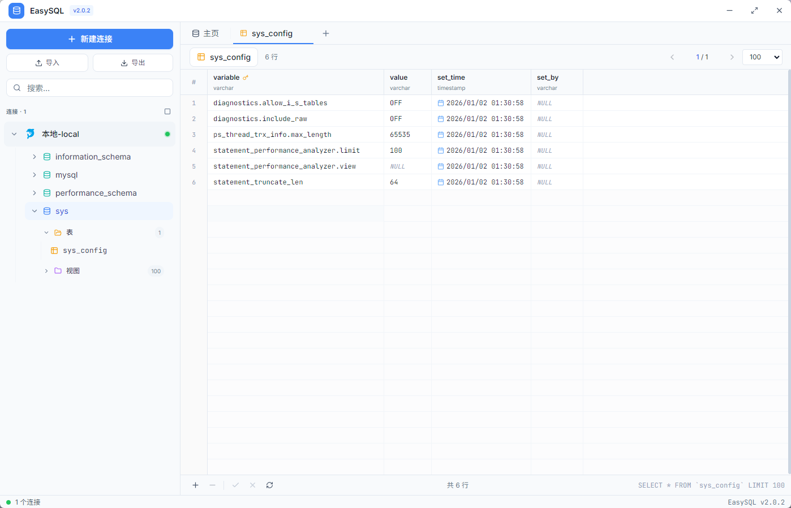

# 🗄️ EasySQL

<div align="center">


**简洁高效的数据库管理工具**

*轻量 · 高性能 · 跨平台*

[下载](#-快速开始) · [功能](#-特性) · [截图](#-界面预览) · [文档](#-配置说明)

</div>

---

## ✨ 特性

- 🚀 **跨平台支持** - 基于 Electron，完美支持 Windows、macOS、Linux
- ⚡ **高性能** - 原生数据库驱动，毫秒级响应，虚拟滚动支持大数据量
- 🎨 **现代化 UI** - 简约清新的浅色主题，圆角设计，舒适的视觉体验
- 🔌 **多数据库** - 支持 MySQL、PostgreSQL、SQLite、SQL Server、MongoDB、Redis、MariaDB 等
- 📝 **智能编辑器** - 基于 Monaco Editor，SQL 语法高亮、智能补全
- 📊 **数据编辑** - 双击单元格直接编辑，支持新增/删除行
- 🛠️ **表设计器** - Navicat 风格，可视化编辑字段、索引、外键
- 📤 **导入导出** - 支持 JSON、Navicat NCX 格式连接配置（含密码解密）

## 🗃️ 支持的数据库

<div align="center">

| 数据库 | 状态 | 驱动 |
|:------:|:----:|:----:|
| 🐬 MySQL | ✅ 完全支持 | mysql2 |
| 🐘 PostgreSQL | ✅ 完全支持 | pg |
| 💾 SQLite | ✅ 完全支持 | sql.js |
| 📊 SQL Server | ✅ 完全支持 | mssql |
| 🦭 MariaDB | ✅ 完全支持 | mysql2 |
| 🍃 MongoDB | ✅ 完全支持 | mongodb |
| ⚡ Redis | ✅ 完全支持 | ioredis |
| 🔶 Oracle | 🚧 计划中 | - |
| ❄️ Snowflake | 🚧 计划中 | - |

</div>

## 📸 界面预览

### 主页

简洁的欢迎界面，展示支持的数据库类型，快速开始查询。


### 数据浏览

直观的数据表格视图，支持分页、排序，双击单元格可直接编辑数据。



### SQL 查询

强大的 SQL 编辑器，基于 Monaco Editor，支持语法高亮、代码补全、格式化。


### 表设计器

Navicat 风格的表结构设计器，可视化管理字段、索引、外键、表选项。


## 🚀 快速开始

### 环境要求

- Node.js 18+
- npm 或 yarn

### 安装运行

```bash
# 克隆项目
git clone https://github.com/your-repo/easysql.git
cd easysql

# 安装依赖
npm install

# 开发模式运行
npm run electron:dev

# 构建应用
npm run electron:build
```

## 🛠️ 技术栈

| 类别 | 技术 |
|------|------|
| 运行时 | Electron 33 |
| 前端框架 | React 18 + TypeScript 5 |
| 样式 | Tailwind CSS 3 |
| 构建工具 | Vite 5 |
| 代码编辑器 | Monaco Editor |
| 数据库驱动 | mysql2, pg, sql.js, mssql, mongodb, ioredis |

## ⌨️ 快捷键

| 快捷键 | 功能 |
|--------|------|
| `Ctrl+Q` | 新建查询 |
| `Ctrl+Enter` | 执行 SQL |
| `Ctrl+S` | 保存修改 |
| `Ctrl+O` | 打开 SQL 文件 |
| `Ctrl+Shift+F` | 格式化 SQL |
| `Ctrl+W` | 关闭当前标签 |
| `双击连接` | 快速连接数据库 |
| `双击单元格` | 编辑单元格数据 |

## 📁 项目结构

```
easysql/
├── electron/              # Electron 主进程
│   ├── main.js            # 主程序入口
│   └── preload.js         # 预加载脚本
├── src/                   # React 前端
│   ├── components/        # UI 组件
│   │   ├── Sidebar.tsx           # 侧边栏
│   │   ├── MainContent.tsx       # 主内容区
│   │   ├── SqlEditor.tsx         # SQL 编辑器
│   │   ├── VirtualDataTable.tsx  # 虚拟滚动表格
│   │   ├── TableDesigner.tsx     # 表设计器
│   │   └── ...
│   ├── lib/               # 工具库
│   └── App.tsx            # 应用入口
├── docs/                  # 文档和截图
└── package.json
```

## 🔧 配置说明

连接配置自动保存在用户配置目录：

| 系统 | 路径 |
|------|------|
| Windows | `%APPDATA%\easysql\connections.json` |
| macOS | `~/Library/Application Support/easysql/connections.json` |
| Linux | `~/.config/easysql/connections.json` |

## 📦 构建命令

```bash
# 开发模式
npm run electron:dev

# 构建（自动递增补丁版本）
npm run electron:build

# 构建（递增次版本）
npm run electron:build:minor

# 构建（递增主版本）
npm run electron:build:major
```

## 🤝 贡献

欢迎提交 Issue 和 Pull Request！

## 📄 License

[MIT](LICENSE)

---

<div align="center">

Made with ❤️ by EasySQL Team

**[⬆ 返回顶部](#️-easysql)**

</div>
